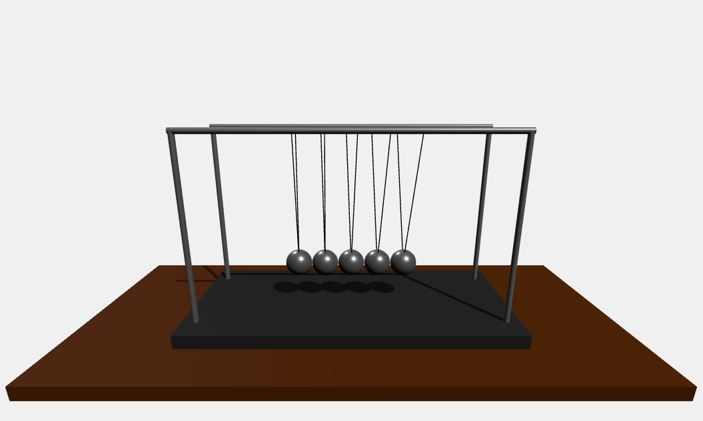

# Newton's Cradle Simulation with Basic Physics Calculations

## Overview

This project is a simulation of Newton's Cradle using WebAssembly and Emscripten. The simulation is rendered using Three.js and includes physics calculations for realistic motion.

## Project Structure

- **src/**: Contains the source code for the physics simulation and rendering.
  - `physics_wrapper.cpp`: Main entry point for the physics simulation.
  - `Ball.cpp`: Implementation of the ball physics.
  - `RigidBody.cpp`: Implementation of the rigid body physics.
  - `Ball.h`, `RigidBody.h`, `Vec3D.h`: Header files for the respective implementations.
- **build/**: Contains the build artifacts and configuration files (not included in the repository).
- **test.html**: HTML file to run the simulation in a web browser.

## Build Instructions

### Prerequisites

- **Emscripten**: For compiling C++ code to WebAssembly.
- **CMake**: For managing the build process.
- **Ninja**: For building the project.
- **Node.js**: Required for running the Emscripten cross-compiling emulator.

### Setting Up the Environment

1. **Set up Emscripten environment**:
   ```sh
   source /path/to/emsdk/emsdk_env.sh
   ```

### Building the Project

You can use the provided build scripts to configure and build the project. Ensure that the paths in the scripts are specific to your environment.

#### For Windows

1. **Run the build script**:
   ```sh
   ./build.bat
   ```

#### For macOS/Linux

1. **Run the build script**:
   ```sh
   ./build.sh
   ```

### Note

The repository does not contain any build files. You need to ensure that the paths in the build scripts (`build.bat` and `build.sh`) are specific to your environment.

## Running the Simulation

1. Run the  respective build script with the prerequisites installed
2. Open `test.html` in a web browser to view the simulation.


## Acknowledgements

- Emscripten for enabling C++ to WebAssembly compilation.
- Three.js for providing a powerful 3D rendering library.
